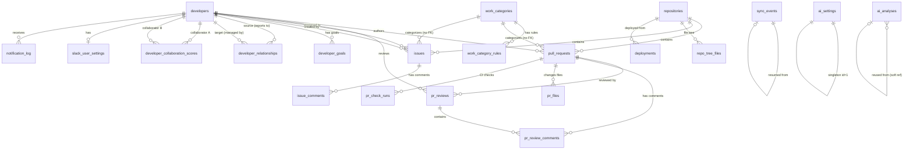

# Data Model

## ER Diagram

## Tables

### `developers`

Team registry with GitHub identity and app role.

| Column | Type | Nullable | Key | Notes |
|--------|------|----------|-----|-------|
| `id` | Integer | NO | PK | |
| `github_username` | String(255) | NO | UNIQUE, INDEX | |
| `display_name` | String(255) | NO | | |
| `email` | String(255) | YES | | |
| `role` | String(50) | YES | | Engineering role (no DB constraint) |
| `skills` | JSONB | YES | | `list[str]` (ORM annotation says `dict` -- mismatch) |
| `specialty` | String(255) | YES | | |
| `location` | String(255) | YES | | |
| `timezone` | String(50) | YES | | |
| `team` | String(255) | YES | | |
| `office` | String(255) | YES | | Free-form office location |
| `app_role` | String(20) | NO | | `"admin"` or `"developer"` (default) |
| `is_active` | Boolean | NO | | Default `True`. Toggled via PATCH (deactivate/reactivate) or DELETE (soft-delete). Auto-reactivated by sync when inactive dev appears in GitHub activity. |
| `avatar_url` | Text | YES | | Populated by sync |
| `notes` | Text | YES | | |
| `created_at` | DateTime(tz) | NO | | Python-side `datetime.utcnow` |
| `updated_at` | DateTime(tz) | NO | | Auto-updated |

### `repositories`

GitHub repos with tracking toggle.

| Column | Type | Nullable | Key | Notes |
|--------|------|----------|-----|-------|
| `id` | Integer | NO | PK | |
| `github_id` | BigInteger | NO | UNIQUE | |
| `name` | String(255) | YES | | |
| `full_name` | String(512) | YES | INDEX | `org/repo` format |
| `description` | Text | YES | | |
| `language` | String(100) | YES | | |
| `is_tracked` | Boolean | NO | | Default `True` |
| `default_branch` | String(255) | YES | | |
| `tree_truncated` | Boolean | NO | | Default `False` |
| `last_synced_at` | DateTime(tz) | YES | | |
| `created_at` | DateTime(tz) | NO | | |

### `pull_requests`

PRs with pre-computed cycle times and issue linkage.

| Column | Type | Nullable | Key | Notes |
|--------|------|----------|-----|-------|
| `id` | Integer | NO | PK | |
| `github_id` | BigInteger | NO | | |
| `repo_id` | Integer | NO | FK -> repositories | |
| `author_id` | Integer | YES | FK -> developers | Nullable, backfilled |
| `number` | Integer | NO | | UNIQUE(repo_id, number) |
| `title` | Text | YES | | |
| `body` | Text | YES | | |
| `state` | String(20) | YES | | open/closed |
| `is_merged` | Boolean | YES | | |
| `is_draft` | Boolean | YES | | Filtered from open counts |
| `additions/deletions/changed_files` | Integer | YES | | |
| `comments_count/review_comments_count` | Integer | YES | | |
| `created_at/updated_at/merged_at/closed_at` | DateTime(tz) | YES | | |
| `first_review_at` | DateTime(tz) | YES | | |
| `time_to_first_review_s` | Integer | YES | | Pre-computed at sync |
| `time_to_merge_s` | Integer | YES | | Pre-computed at sync |
| `approved_at` | DateTime(tz) | YES | | |
| `approval_count` | Integer | NO | | Default 0 |
| `time_to_approve_s` | Integer | YES | | |
| `time_after_approve_s` | Integer | YES | | |
| `merged_without_approval` | Boolean | NO | | Default False |
| `review_round_count` | Integer | NO | | CHANGES_REQUESTED count |
| `closes_issue_numbers` | JSONB | YES | | `list[int]` |
| `labels` | JSONB | YES | | `list[str]` |
| `merged_by_username` | String(255) | YES | | |
| `head_branch/base_branch` | String(255) | YES | | |
| `is_self_merged` | Boolean | NO | | |
| `is_revert` | Boolean | NO | | |
| `reverted_pr_number` | Integer | YES | | |
| `html_url` | Text | YES | | |
| `head_sha` | String(40) | YES | | For check-run lookups |
| `work_category` | String(50) | YES | | Values: feature, bugfix, tech_debt, ops, unknown (admin-extensible). Widened to 50 by migration 030. |
| `work_category_source` | String(20) | YES | | Classification provenance: label, title, prefix, ai, manual, cross_ref |
| `author_github_username` | String(255) | YES | | For backfill |

**Indexes:** `ix_pr_author_created` on (author_id, created_at)

### `pr_reviews`

Reviews with quality tier classification.

| Column | Type | Nullable | Key | Notes |
|--------|------|----------|-----|-------|
| `id` | Integer | NO | PK | |
| `github_id` | BigInteger | NO | UNIQUE | |
| `pr_id` | Integer | NO | FK -> pull_requests | |
| `reviewer_id` | Integer | YES | FK -> developers | Nullable, backfilled |
| `state` | String(30) | YES | | APPROVED, CHANGES_REQUESTED, etc. |
| `body` | Text | YES | | |
| `body_length` | Integer | NO | | Default 0 |
| `quality_tier` | String(20) | NO | | thorough/standard/rubber_stamp/minimal |
| `reviewer_github_username` | String(255) | YES | | For backfill |
| `submitted_at` | DateTime(tz) | YES | | |

### `pr_review_comments`

Inline code review comments with type classification.

| Column | Type | Nullable | Key | Notes |
|--------|------|----------|-----|-------|
| `id` | Integer | NO | PK | |
| `github_id` | BigInteger | NO | UNIQUE | |
| `pr_id` | Integer | NO | FK -> pull_requests | |
| `review_id` | Integer | YES | FK -> pr_reviews | |
| `author_github_username` | String(255) | YES | | No FK to developers |
| `body` | Text | YES | | |
| `path` | Text | YES | | File path |
| `line` | Integer | YES | | |
| `comment_type` | String(30) | YES | | nit/blocker/architectural/etc. |
| `mentions` | JSONB | YES | | `list[str]` — @usernames extracted at sync time |
| `created_at/updated_at` | DateTime(tz) | YES | | |

### `pr_files`

File-level changes per PR.

| Column | Type | Nullable | Key | Notes |
|--------|------|----------|-----|-------|
| `id` | Integer | NO | PK | |
| `pr_id` | Integer | NO | FK -> pull_requests | INDEX |
| `filename` | Text | NO | | INDEX, UNIQUE(pr_id, filename) |
| `additions/deletions` | Integer | NO | | Default 0 |
| `status` | String(20) | YES | | added/modified/removed/renamed |
| `previous_filename` | Text | YES | | For renames |

### `pr_check_runs`

CI/CD check runs per PR.

| Column | Type | Nullable | Key | Notes |
|--------|------|----------|-----|-------|
| `id` | Integer | NO | PK | |
| `pr_id` | Integer | NO | FK -> pull_requests | INDEX |
| `check_name` | String(255) | NO | | INDEX, UNIQUE(pr_id, check_name, run_attempt) |
| `conclusion` | String(30) | YES | | success/failure/neutral/etc. |
| `started_at/completed_at` | DateTime(tz) | YES | | |
| `duration_s` | Integer | YES | | |
| `run_attempt` | Integer | NO | | Default 1 |

### `repo_tree_files`

Full repo file tree snapshot for stale directory detection.

| Column | Type | Nullable | Key | Notes |
|--------|------|----------|-----|-------|
| `id` | Integer | NO | PK | |
| `repo_id` | Integer | NO | FK -> repositories | INDEX, UNIQUE(repo_id, path) |
| `path` | Text | NO | | |
| `type` | String(10) | NO | | blob/tree |
| `last_synced_at` | DateTime(tz) | YES | | |

### `issues`

Issues with close-time computation and quality scoring.

| Column | Type | Nullable | Key | Notes |
|--------|------|----------|-----|-------|
| `id` | Integer | NO | PK | |
| `github_id` | BigInteger | NO | | UNIQUE(repo_id, number) |
| `repo_id` | Integer | NO | FK -> repositories | |
| `assignee_id` | Integer | YES | FK -> developers | Nullable, backfilled |
| `assignee_github_username` | String(255) | YES | | For backfill |
| `creator_id` | Integer | YES | FK -> developers | Resolved at sync time via `resolve_author()` |
| `number` | Integer | NO | | |
| `title/body` | Text | YES | | |
| `state` | String(20) | YES | | |
| `labels` | JSONB | YES | | `list[str]` (ORM says `dict` -- mismatch) |
| `created_at/updated_at/closed_at` | DateTime(tz) | YES | | |
| `time_to_close_s` | Integer | YES | | Pre-computed |
| `html_url` | Text | YES | | |
| `comment_count` | Integer | NO | | Default 0 |
| `body_length` | Integer | NO | | Default 0 |
| `has_checklist` | Boolean | NO | | Default False |
| `state_reason` | String(30) | YES | | completed/not_planned |
| `creator_github_username` | String(255) | YES | | |
| `milestone_title` | String(255) | YES | | |
| `milestone_due_on` | Date | YES | | |
| `reopen_count` | Integer | NO | | Default 0 |
| `work_category` | String(50) | YES | | Values: feature, bugfix, tech_debt, ops, unknown (admin-extensible). Widened to 50 by migration 030. |
| `work_category_source` | String(20) | YES | | Classification provenance: label, title, prefix, ai, manual, cross_ref |

### `issue_comments`

| Column | Type | Nullable | Key | Notes |
|--------|------|----------|-----|-------|
| `id` | Integer | NO | PK | |
| `github_id` | BigInteger | NO | UNIQUE | |
| `issue_id` | Integer | NO | FK -> issues | |
| `author_github_username` | String(255) | YES | | No FK to developers |
| `body` | Text | YES | | |
| `mentions` | JSONB | YES | | `list[str]` — @usernames extracted at sync time |
| `created_at` | DateTime(tz) | YES | | |

### `sync_events`

Sync run audit log with granular progress tracking.

| Column | Type | Nullable | Key | Notes |
|--------|------|----------|-----|-------|
| `id` | Integer | NO | PK | |
| `sync_type` | String(30) | YES | | full/incremental/contributors |
| `status` | String(30) | YES | | started/completed/completed_with_errors/failed/cancelled |
| `repos_synced/prs_upserted/issues_upserted` | Integer | YES | | Aggregate counts |
| `errors` | JSONB | YES | | `list[dict]` structured errors |
| `started_at/completed_at` | DateTime(tz) | YES | | |
| `duration_s` | Integer | YES | | |
| `repo_ids` | JSONB | YES | | `list[int]` repos to sync |
| `since_override` | DateTime(tz) | YES | | |
| `total_repos` | Integer | YES | | |
| `current_repo_name` | String(512) | YES | | Active repo |
| `current_step` | String(50) | YES | | Active phase |
| `current_repo_prs_total/done` | Integer | YES | | Item-level progress |
| `current_repo_issues_total/done` | Integer | YES | | Item-level progress |
| `repos_completed` | JSONB | YES | | `list[dict]` default `[]` |
| `repos_failed` | JSONB | YES | | `list[dict]` default `[]` |
| `is_resumable` | Boolean | NO | | Default False |
| `resumed_from_id` | Integer | YES | FK -> sync_events (self) | No ORM relationship |
| `cancel_requested` | Boolean | NO | | Default False |
| `log_summary` | JSONB | YES | | `list[dict]` capped at 500 |
| `rate_limit_wait_s` | Integer | NO | | Default 0 |
| `triggered_by` | String(50) | YES | | `"manual"`, `"scheduled"`, `"auto_resume"` |
| `sync_scope` | String(255) | YES | | Human-readable label, e.g., "3 repos · 30 days" |

### `sync_schedule_config`

Singleton (id=1) auto-sync schedule configuration. Loaded on startup, live-updated via `PATCH /sync/schedule`.

| Column | Type | Nullable | Key | Notes |
|--------|------|----------|-----|-------|
| `id` | Integer | NO | PK | Always 1 |
| `auto_sync_enabled` | Boolean | NO | | Default True |
| `incremental_interval_minutes` | Integer | NO | | Default 15, min 5 |
| `full_sync_cron_hour` | Integer | NO | | Default 2 (0-23) |
| `updated_at` | DateTime(tz) | YES | | Auto-updated on change |

### `ai_analyses`

AI analysis results with cost tracking.

| Column | Type | Nullable | Key | Notes |
|--------|------|----------|-----|-------|
| `id` | Integer | NO | PK | |
| `analysis_type` | String(50) | YES | | |
| `scope_type/scope_id` | String | YES | | |
| `date_from/date_to` | DateTime(tz) | YES | | |
| `input_summary` | Text | YES | | |
| `result` | JSONB | YES | | Varies by analysis_type |
| `raw_response` | Text | YES | | Not exposed in API |
| `model_used` | String(100) | YES | | |
| `tokens_used/input_tokens/output_tokens` | Integer | YES | | Split tracking |
| `estimated_cost_usd` | Float | YES | | |
| `reused_from_id` | Integer | YES | | Soft ref (no FK constraint) |
| `triggered_by` | String(255) | YES | | |
| `created_at` | DateTime(tz) | NO | | |

### `ai_settings`

Singleton (id=1) AI configuration.

| Column | Type | Nullable | Default | Notes |
|--------|------|----------|---------|-------|
| `id` | Integer | NO | PK | Always 1 |
| `ai_enabled` | Boolean | NO | True | Master switch |
| `feature_general_analysis/one_on_one_prep/team_health/work_categorization` | Boolean | NO | True | Per-feature toggles |
| `monthly_token_budget` | Integer | YES | | NULL = unlimited |
| `budget_warning_threshold` | Float | NO | 0.8 | |
| `input_token_price_per_million/output_token_price_per_million` | Float | NO | 3.0/15.0 | |
| `pricing_updated_at` | DateTime(tz) | YES | | |
| `cooldown_minutes` | Integer | NO | 30 | |
| `updated_at` | DateTime(tz) | NO | `func.now()` | |
| `updated_by` | String(255) | YES | | |

### `ai_usage_log`

Token usage tracking for work categorization AI calls.

| Column | Type | Nullable | Notes |
|--------|------|----------|-------|
| `id` | Integer | NO | PK |
| `feature` | String(50) | NO | |
| `input_tokens/output_tokens` | Integer | YES | |
| `items_classified` | Integer | YES | |
| `created_at` | DateTime(tz) | NO | INDEX (migration only, not in ORM) |

### `developer_goals`

Goal tracking with metric targets.

| Column | Type | Nullable | Key | Notes |
|--------|------|----------|-----|-------|
| `id` | Integer | NO | PK | |
| `developer_id` | Integer | NO | FK -> developers, INDEX | |
| `title` | String(255) | NO | | |
| `description` | Text | YES | | |
| `metric_key` | String(100) | NO | | No DB constraint on values |
| `target_value` | Float | NO | | |
| `target_direction` | String(10) | NO | | `"above"` or `"below"` |
| `baseline_value` | Float | YES | | Computed at creation |
| `status` | String(20) | NO | | active/achieved/paused/abandoned |
| `created_at` | DateTime(tz) | NO | | |
| `target_date` | Date | YES | | |
| `achieved_at` | DateTime(tz) | YES | | |
| `notes` | Text | YES | | |
| `created_by` | String(10) | YES | | `"self"` or `"admin"` |

### `deployments`

DORA deployment records from GitHub Actions, with failure tracking for CFR/MTTR.

| Column | Type | Nullable | Key | Notes |
|--------|------|----------|-----|-------|
| `id` | Integer | NO | PK | |
| `repo_id` | Integer | NO | FK -> repositories | INDEX, UNIQUE(repo_id, workflow_run_id) |
| `environment` | String(100) | YES | | From `DEPLOY_ENVIRONMENT` config |
| `sha` | String(40) | YES | | Deployed commit SHA |
| `deployed_at` | DateTime(tz) | YES | | INDEX |
| `workflow_name` | String(255) | YES | | |
| `workflow_run_id` | BigInteger | NO | | |
| `status` | String(30) | YES | | Workflow conclusion: `success`, `failure`, etc. |
| `lead_time_s` | Integer | YES | | Computed post-sync for successful deploys |
| `is_failure` | Boolean | NO | | Default `false`. Set by `detect_deployment_failures()` |
| `failure_detected_via` | String(30) | YES | | `"failed_deploy"`, `"revert_pr"`, or `"hotfix_pr"` |
| `recovered_at` | DateTime(tz) | YES | | Timestamp of recovery deployment |
| `recovery_deployment_id` | Integer | YES | FK -> deployments | Self-referential: the deployment that fixed this failure |
| `recovery_time_s` | Integer | YES | | Seconds from failure to recovery |

### `developer_relationships`

Generic organizational hierarchy. Supports multiple concurrent relationship types per developer.

| Column | Type | Nullable | Key | Notes |
|--------|------|----------|-----|-------|
| `id` | Integer | NO | PK | |
| `source_id` | Integer | NO | FK -> developers | INDEX. The "from" developer |
| `target_id` | Integer | NO | FK -> developers | INDEX. The "to" developer |
| `relationship_type` | String(30) | NO | INDEX | `reports_to`, `tech_lead_of`, `team_lead_of` |
| `created_by` | String(255) | YES | | Admin username who set this |
| `created_at` | DateTime(tz) | NO | | |
| `updated_at` | DateTime(tz) | NO | | |

**Constraints:** `UNIQUE(source_id, target_id, relationship_type)`, `CHECK(source_id != target_id)`

**Semantics:** `(alice, bob, "reports_to")` = Alice reports to Bob. `(carol, dev, "tech_lead_of")` = Carol is tech lead of dev. A developer can have one `reports_to`, one `tech_lead_of`, and one `team_lead_of` target simultaneously.

### `developer_collaboration_scores`

Materialized multi-signal collaboration scores per developer pair. Recomputed after each sync via `recompute_collaboration_scores()`.

| Column | Type | Nullable | Key | Notes |
|--------|------|----------|-----|-------|
| `id` | Integer | NO | PK | |
| `developer_a_id` | Integer | NO | FK -> developers | INDEX. Always `< developer_b_id` |
| `developer_b_id` | Integer | NO | FK -> developers | INDEX |
| `period_start` | DateTime(tz) | NO | | |
| `period_end` | DateTime(tz) | NO | | |
| `review_score` | Float | NO | | Normalized [0,1]. Weight: 0.35 |
| `coauthor_score` | Float | NO | | Normalized [0,1]. Weight: 0.15 |
| `issue_comment_score` | Float | NO | | Normalized [0,1]. Weight: 0.20 |
| `mention_score` | Float | NO | | Normalized [0,1]. Weight: 0.15 |
| `co_assigned_score` | Float | NO | | Normalized [0,1]. Weight: 0.15 |
| `total_score` | Float | NO | | INDEX. Weighted sum [0,1] |
| `interaction_count` | Integer | NO | | Raw un-normalized sum |
| `updated_at` | DateTime(tz) | NO | | |

**Constraints:** `UNIQUE(developer_a_id, developer_b_id, period_start, period_end)`, `CHECK(developer_a_id < developer_b_id)` (canonical pair ordering)

**Signals:** PR reviews (cap 20), co-repo authoring (cap 5), issue co-comments (cap 10), @mentions (cap 10), co-assignment (cap 5). Each normalized to [0,1] via `min(count/cap, 1.0)`.

### `slack_config`

Singleton (id=1) global Slack integration configuration. Bot token, notification type toggles, thresholds, and schedule settings.

| Column | Type | Null | Default | Notes |
|--------|------|------|---------|-------|
| `id` | Integer PK | NO | | Always 1 |
| `slack_enabled` | Boolean | NO | false | Master toggle |
| `bot_token` | Text | YES | | Slack Bot User OAuth Token (xoxb-...). Stored plaintext. |
| `default_channel` | String(255) | YES | | Fallback channel for sync notifications |
| `notify_stale_prs` | Boolean | NO | true | Global toggle |
| `notify_high_risk_prs` | Boolean | NO | true | |
| `notify_workload_alerts` | Boolean | NO | true | |
| `notify_sync_failures` | Boolean | NO | true | |
| `notify_sync_complete` | Boolean | NO | false | |
| `notify_weekly_digest` | Boolean | NO | true | |
| `stale_pr_days_threshold` | Integer | NO | 3 | Days before PR is stale |
| `risk_score_threshold` | Float | NO | 0.7 | Risk score above which to alert |
| `digest_day_of_week` | Integer | NO | 0 | 0=Mon..6=Sun |
| `digest_hour_utc` | Integer | NO | 9 | |
| `stale_check_hour_utc` | Integer | NO | 9 | |
| `updated_at` | DateTime(tz) | NO | now() | |
| `updated_by` | String(255) | YES | | |

### `slack_user_settings`

Per-developer Slack notification preferences and Slack user ID for DM delivery.

| Column | Type | Null | Default | Notes |
|--------|------|------|---------|-------|
| `id` | Integer PK | NO | | |
| `developer_id` | Integer FK | NO | | UNIQUE. FK → developers |
| `slack_user_id` | String(50) | YES | | Slack member ID (e.g., U0123456789) |
| `notify_stale_prs` | Boolean | NO | true | |
| `notify_high_risk_prs` | Boolean | NO | true | |
| `notify_workload_alerts` | Boolean | NO | true | |
| `notify_weekly_digest` | Boolean | NO | true | |
| `created_at` | DateTime(tz) | NO | now() | |
| `updated_at` | DateTime(tz) | NO | now() | |

### `notification_log`

Audit trail for all Slack notifications sent by DevPulse.

| Column | Type | Null | Default | Notes |
|--------|------|------|---------|-------|
| `id` | Integer PK | NO | | |
| `notification_type` | String(50) | NO | | INDEX. stale_pr, high_risk_pr, workload, sync_complete, sync_failure, weekly_digest, test |
| `channel` | String(255) | YES | | Channel ID or Slack user ID (for DMs) |
| `recipient_developer_id` | Integer FK | YES | | FK → developers. NULL for channel messages. |
| `status` | String(20) | NO | sent | INDEX. sent or failed |
| `error_message` | Text | YES | | Slack API error if failed |
| `payload` | JSONB | YES | | Message content for debugging |
| `created_at` | DateTime(tz) | NO | now() | INDEX |

### `benchmark_group_config`

Admin-configurable peer group definitions for benchmarks.

| Column | Type | Null | Default | Notes |
|--------|------|------|---------|-------|
| `id` | Integer PK | NO | | |
| `group_key` | String(50) | NO | | UNIQUE. e.g., "ics", "leads", "devops", "qa" |
| `display_name` | String(100) | NO | | |
| `display_order` | Integer | NO | 0 | |
| `roles` | JSONB | NO | | `list[str]` — role_keys included in this group |
| `metrics` | JSONB | NO | | `list[str]` — metric keys from `BENCHMARK_METRICS` registry |
| `min_team_size` | Integer | NO | 3 | Minimum developers for team comparison |
| `is_default` | Boolean | NO | false | Seeded groups — cannot be deleted |
| `created_at` | DateTime(tz) | NO | now() | |
| `updated_at` | DateTime(tz) | NO | now() | |

4 default groups seeded: IC Engineers, Engineering Leads, DevOps, QA Engineers.

### `role_definitions`

Admin-configurable role definitions. Each role maps to a fixed `contribution_category` that controls how the role participates in statistics.

| Column | Type | Null | Default | Notes |
|--------|------|------|---------|-------|
| `role_key` | String(50) PK | NO | | e.g., "developer", "product_manager" |
| `display_name` | String(100) | NO | | Human-readable label |
| `contribution_category` | String(30) | NO | | `code_contributor`, `issue_contributor`, `non_contributor`, `system` |
| `display_order` | Integer | NO | 0 | For UI ordering |
| `is_default` | Boolean | NO | false | Seeded roles — cannot be deleted |
| `created_at` | DateTime(tz) | NO | now() | |
| `updated_at` | DateTime(tz) | NO | now() | |

15 default roles seeded by migrations 027 and 029:

| Category | Roles |
|----------|-------|
| `code_contributor` | developer, senior_developer, lead, architect, devops, senior_devops, qa, intern |
| `issue_contributor` | product_manager, product_owner, engineering_manager, scrum_master |
| `non_contributor` | designer, other |
| `system` | system_account |

`developers.role` (String(50)) references `role_definitions.role_key` — validated at the API layer, not via DB FK constraint.

### `teams`

Canonical team name registry. `Developer.team` stores team names as free-text strings; `teams.name` provides the authoritative set. No FK from `developers.team` to `teams.name` — consistency enforced by service logic (`resolve_team()`) only.

| Column | Type | Nullable | Key | Notes |
|--------|------|----------|-----|-------|
| `id` | Integer | NO | PK | |
| `name` | String(100) | NO | UNIQUE | Canonical team name |
| `display_order` | Integer | NO | | Default 0 |
| `created_at` | DateTime(tz) | NO | | |
| `updated_at` | DateTime(tz) | NO | | |

### `work_categories`

Admin-configurable work category definitions. 5 defaults seeded: feature, bugfix, tech_debt, ops, unknown.

| Column | Type | Nullable | Key | Notes |
|--------|------|----------|-----|-------|
| `category_key` | String(50) | NO | PK | e.g., "feature", "bugfix" |
| `display_name` | String(100) | NO | | Human-readable label |
| `color` | String(7) | NO | | Hex color (e.g., "#3B82F6") |
| `exclude_from_stats` | Boolean | NO | | Default false |
| `display_order` | Integer | NO | | For UI ordering |
| `is_default` | Boolean | NO | | Seeded categories — cannot be deleted |
| `created_at` | DateTime(tz) | NO | | |
| `updated_at` | DateTime(tz) | NO | | |

### `work_category_rules`

Admin-configurable classification rules evaluated by priority. 31 defaults seeded (27 label + 4 title_regex).

| Column | Type | Nullable | Key | Notes |
|--------|------|----------|-----|-------|
| `id` | Integer | NO | PK | |
| `match_type` | String(20) | NO | | `label`, `title_regex`, or `prefix` |
| `match_value` | String(255) | NO | | Label name, regex pattern, or prefix |
| `case_sensitive` | Boolean | NO | | Default false |
| `category_key` | String(50) | NO | FK → work_categories | Target category |
| `priority` | Integer | NO | INDEX | Lower = evaluated first |
| `created_at` | DateTime(tz) | NO | | |
| `updated_at` | DateTime(tz) | NO | | |

`pull_requests.work_category` and `issues.work_category` reference `work_categories.category_key` but have no FK constraint — service-layer enforcement only.

## Design Decisions

### Nullable Author/Reviewer/Assignee FKs

GitHub data arrives before contributors may be in the `developers` table. `resolve_author()` auto-creates developers from embedded GitHub user data during sync, but the FK is left NULL when no user data is available. If `resolve_author()` finds an existing but inactive developer, it auto-reactivates them (`is_active=True`, flush, warning log) since their presence in GitHub activity implies they are contributing again. Raw usernames are stored in companion `_github_username` columns. `backfill_author_links()` bulk-updates NULLs using EXISTS guards after each sync.

### Pre-Computed Cycle Times

`time_to_first_review_s`, `time_to_merge_s`, `time_to_approve_s`, `time_after_approve_s`, and `time_to_close_s` are computed at sync time rather than query time. This avoids expensive date arithmetic in stats queries.

### JSONB Columns

- **`closes_issue_numbers`** (`list[int]`): Parsed from PR body keywords like "Closes #123"
- **`labels`** (`list[str]`): GitHub label names
- **`log_summary`** (`list[dict]`): Capped at 500 entries with priority eviction (oldest info dropped first). Each entry: `{level, repo, message, timestamp}`
- **`repos_completed/repos_failed`** (`list[dict]`): Per-repo sync result records
- **`errors`** (`list[dict]`): Structured via `make_sync_error()` helper
- **`result`** (ai_analyses): Shape varies by `analysis_type`; whatever Claude returns
- **`skills`** (`list[str]`): Developer skill tags
- **`mentions`** (`list[str]`): @usernames extracted from comment bodies at sync time via `extract_mentions()` regex. Present on `pr_review_comments` and `issue_comments`

JSONB columns are mutated via `_append_jsonb()` helper which reassigns the column to trigger SQLAlchemy change detection.

### No Cascade Rules

No FK has `ondelete="CASCADE"` and no relationship has `cascade="all, delete-orphan"`. Deleting a repository would cause FK violations. This is intentional -- the app never deletes GitHub data.

### No Commit-Level Data

Stats are PR-level only to stay within GitHub API rate limits.

## Migration Patterns

31 migrations from `000_initial_schema` through `030_add_work_categories_and_rules`. The chain has two merge points (004 and 007) where parallel feature branches were reconciled.

`000_initial_schema` is the root migration (`down_revision = None`). It creates the 10 base tables (`developers`, `repositories`, `pull_requests`, `pr_reviews`, `pr_review_comments`, `issues`, `issue_comments`, `sync_events`, `ai_analyses`, `developer_goals`) with their original columns. All subsequent migrations are additive from this base. `alembic upgrade head` is self-contained on a blank database.

Recent migrations (023-030): `benchmark_group_config` table + 4 seeded groups (023), `work_category_source` columns on PRs and issues (024), `sync_schedule_config` singleton (025), `triggered_by` and `sync_scope` on sync_events (026), `role_definitions` table + 13 seeded roles + `issues.creator_id` FK (027), missing indexes on `issue_comments.issue_id` and `pr_review_comments.pr_id` (028), `teams` table + 2 new seeded roles (`senior_devops`, `other`) (029), `work_categories` + `work_category_rules` tables with seed data + widen `work_category` columns to String(50) (030).

Convention: additive migrations only (ADD COLUMN, CREATE TABLE). No destructive DDL.

## Architectural Concerns

| Severity | Area | Description |
|----------|------|-------------|
| ~~High~~ | ~~Migrations~~ | ~~No `000_initial_schema` migration~~ — **Resolved:** `000_initial_schema.py` now creates all base tables |
| ~~Medium~~ | ~~Indexes~~ | ~~Missing indexes on frequently-filtered columns~~ — **Resolved:** Migration 022 adds indexes on `pull_requests.state/merged_at/repo_id`, `pr_reviews.pr_id/submitted_at`, `issues.state/assignee_id`, `sync_events.status` |
| ~~Medium~~ | ~~Types~~ | ~~`developers.skills` ORM annotation is `dict`~~ — **Fixed:** Now `Mapped[list | None]` |
| ~~Medium~~ | ~~Types~~ | ~~`issues.labels` ORM annotation is `dict`~~ — **Fixed:** Now `Mapped[list | None]` |
| ~~Medium~~ | ~~Schema drift~~ | ~~`work_category` columns widened to String(50) in DB (migration 030) but ORM still declares String(20)~~ — **Fixed:** ORM updated to String(50) |
| Medium | Integrity | No FK from `developers.team` to `teams.name` or from `pull_requests.work_category` / `issues.work_category` to `work_categories.category_key` — service-layer enforcement only; direct SQL bypasses validation |
| Medium | Integrity | `ai_analyses.reused_from_id` is a plain Integer, not a FK -- no referential integrity |
| ~~Medium~~ | ~~Schema drift~~ | ~~`ai_usage_log.created_at` index in migration but not ORM~~ — **Fixed:** Added to `AIUsageLog.__table_args__` |
| ~~Medium~~ | ~~Schema drift~~ | ~~`ix_issue_creator_id` index in migration 027 but not ORM~~ — **Fixed:** Added to `Issue.__table_args__` |
| ~~Medium~~ | ~~Missing index~~ | ~~`issue_comments.issue_id` has no index~~ — **Fixed:** Migration 028 + ORM `__table_args__` |
| ~~Medium~~ | ~~Missing index~~ | ~~`pr_review_comments.pr_id` has no index~~ — **Fixed:** Migration 028 + ORM `__table_args__` |
| ~~Medium~~ | ~~Schema drift~~ | ~~`sync_events.repo_ids` declared as `sa.JSON()` in migration 015 but `JSONB` in ORM model~~ — **Resolved:** Migration 022 converts to JSONB |
| ~~Medium~~ | ~~Consistency~~ | ~~`pull_requests.github_id` and `issues.github_id` lack `unique=True`~~ — **Resolved:** Migration 022 adds unique constraints (`uq_pr_github_id`, `uq_issue_github_id`) |
| Low | Defaults | Several non-nullable columns (`developers.is_active`, `developers.created_at`, `developer_goals.target_direction`, all `developer_collaboration_scores` float columns) use Python-only defaults with no `server_default` -- rows inserted outside SQLAlchemy get NULL |
| Low | Timestamps | `datetime.utcnow` (deprecated in Python 3.12+) used as column default instead of `func.now()` |
| ~~Low~~ | ~~Types~~ | ~~`DeveloperGoal.target_date` ORM annotation is `Mapped[datetime | None]` but column is `Date`~~ — **Fixed:** Now `Mapped[date | None]` |
| ~~Low~~ | ~~Timestamps~~ | ~~`SlackUserSettings.updated_at` missing `onupdate`~~ — **Fixed:** Added `onupdate=datetime.utcnow` |
| Low | ORM | `developer_collaboration_scores` has FK columns but no `relationship()` declarations -- cannot use ORM joins |
| Low | ORM | `sync_events.resumed_from_id` FK exists at DB level but has no ORM relationship |
| Low | Missing links | `pr_review_comments` and `issue_comments` have no `author_id` FK -- no developer attribution |
